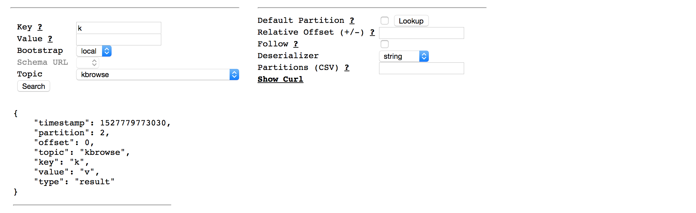

# KBrowse
This is a tool for exploring data on an Apache Kafka cluster.



# Why
Have you ever written a loop like this, for debugging purposes?
```
for record in topic:
    if record.key == "foo":
        print record
```

KBrowse provides this as a service, along with a web console.

Cached results can be shared by copy/pasting the URL.

# Usage
Defaulting to localhost:
```
# Local data
./run-zookeeper-and-kafka

# Server
./lein run server

# Web Console
open http://localhost:4000
```

Using environment overrides:
```
KAFKA_TIMEOUT=30000 KAFKA_BOOTSTRAP_SERVERS='foo=foo.localhost:9092' ./lein run server
```

Different yaml config:
```
CONFIG=config/default-with-avro.yml ./lein run server
```

Uberjar:
```
# Build
./lein uberjar

# Run
CONFIG=foo.yml java $JVM_OPTS -jar kbrowse-*-SNAPSHOT-standalone.jar server
```

# Tests
```
# Requires npm!
./run-tests
```

# Deserialization
KBrowse deserialization options include String, Msgpack, and Avro (with schemas looked up from the KAFKA_SCHEMA_REGISTRY_URLS).

An attempt is made to parse the deserialized results into JSON, before streaming back as part of the response.

# Stateful URL
The web console's state is stored as string-serialized JSON in the browser's window location.  This is an effort to distinguish it visually from what might traditionally be a web form query.  When the web console loads, the query state is initialized from URL state, and an initial query is sent to the server.  If there are any cached results, they are displayed immediately.

This design is intended to support copy/paste-able URLs, so folks can share their findings, with the context baked in.  This can save duplicated query time, and also allows verification of the query itself.

Some browsers may have a limit on the window location length, which could lead to a corrupt state.  This trade-off is accepted, to allow for share-able contexts.

# Browser Support
The web console uses Mozilla's Fetch API, and ES6 keywords such as `let` and `const`.

It is believed that this limits support to newer versions of Chrome, Firefox, and Safari.
